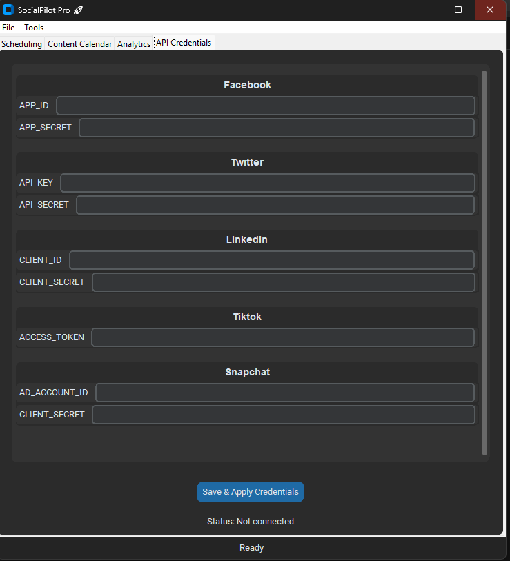

# SocialPilot Pro 🚀  
**Your All-in-One Social Media Management Suite**  

  

---

## 🌟 **Features**  
- **Multi-Platform Scheduling**: Schedule posts across **Facebook, X (Twitter), LinkedIn, TikTok**, and more with a unified interface.  
- **AI-Powered Tools**: Auto-generate captions, optimize hashtags, and analyze post sentiment using NLP.  
- **Content Calendar**: Visualize and manage scheduled posts with an interactive calendar.  
- **Analytics Dashboard**: Track engagement trends with sentiment analysis pie charts and CSV exports.  
- **Secure Credential Storage**: Safely store API keys using system keyrings.  
- **Media Support**: Upload and preview images, with automatic resizing for platform requirements.  
- **Dark/Light Mode**: Modern UI powered by `customtkinter` for a sleek user experience.  

---

## 🛠️ **Tech Stack**  
- **Frontend**: `customtkinter`, `Tkinter`, `PIL` (Image Processing)  
- **Backend**: Python 3.9+  
- **APIs**: `tweepy` (Twitter/X), `Facebook Graph API`, `LinkedIn API`, `TikTokApi`  
- **Analytics**: `TextBlob` (Sentiment Analysis), `pandas`, `matplotlib`  
- **Scheduling**: `schedule`, `pytz` (Timezone Management)  

---

## 🚀 **Installation**  
1. **Clone the repository**:  
   ```bash  
   git clone https://github.com/yourusername/socialpilot-pro.git  
   cd socialpilot-pro  
   ```  

2. **Install dependencies**:  
   ```bash  
   pip install -r requirements.txt  
   ```  

3. **Set up API credentials**:  
   - Navigate to the **API Credentials** tab in the app.  
   - Input keys for your desired platforms (get them from developer portals).  

4. **Run the app**:  
   ```bash  
   python socialpilot-pro.py  
   ```  

---

## 📸 **Screenshots**  
| Creds Interface | Content Calendar | 
|-----------------------|-------------------|
|  |  | 

---

## 📖 **Usage**  
1. **Schedule a Post**:  
   - Select a platform.  
   - Write content (AI caption generator available under **Tools**).  
   - Upload media (if supported).  
   - Set date/time and hit **⏰ Schedule Post**.  

2. **Track Posts**:  
   - Use the **Content Calendar** to view scheduled posts by month.  

3. **Analyze Performance**:  
   - Click **🔄 Analyze Sentiment** to generate sentiment breakdowns.  
   - Export data via **File > Export Analytics**.  

---

## 🔧 **Limitations & Future Enhancements**  
- **Mock Sentiment Data**: Current sentiment analysis uses sample comments. Integrate live API data (e.g., Facebook Comments) for real-world insights.  
- **Expand Platform Support**: Add Instagram, Snapchat, and YouTube.  
- **Team Collaboration**: Multi-user access with role-based permissions.  

---

## 📜 **License**  
MIT License – Free for personal and commercial use.  

---

**✨ Crafted with Python passion by [Khaled]**  
*Add this project to your portfolio to showcase full-stack desktop app development skills!*  

--- 
*Let SocialPilot Pro handle the grind while you focus on creativity!* 🚀
